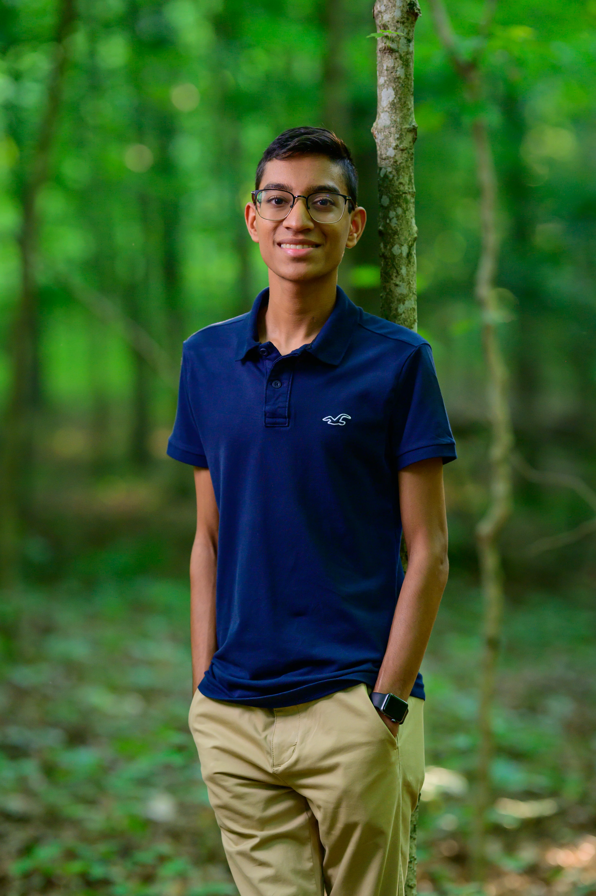

 

Hey there! My name is Neil! I am an Honors Physics and Astronomy & Astrophysics student and Undergraduate Research Assistant at The Ohio State University. I am also going to be pursuing my PhD in Astronomy at the University of Florida this fall!

Here is a little about me (personally):

I enjoy video games! Some of my favorites include: Minecraft, Stardew Valley, Mario Games, GTFO, Hollow Knight, and more!

I love <a href="/photography/index.html">photography</a> as well, including landscape photography, animal photography, and astrophotography! I use a Canon Powershot G7X Mark II and a Sony Alpha 6000 Mirrorless camera to photograph the landscapes of Costa Rica and Hawai'i, the Milky Way galaxy, the stages of a total solar eclipse, animals like hummingbirds and sea turtles, and more!

I like listening to music and playing music! I have been playing guitar (both acoustic and electric) since 2016 and bass guitar since 2018. I was also involved in my high school's jazz band for four years, and I loved every second of it! I also played baritone/euphonium through middle school, and was involved in Ohio's District X Honor Band in 8th grade. I had the immense pleasure during my time as a euphonium player to take part in debuting two brand-new commissioned pieces! These pieces were [*Wind of the Waves*](https://www.youtube.com/watch?v=6iTYzoBgfc0) by Chris M. Bernotas and [*Band of Heroes*](https://www.youtube.com/watch?v=ggFZeEntpMU) by Erika Svanoe.

I play sports in my free time as well. I play tennis and have played it for several years (since 2015), playing through high school on the high school team, and continuing in college as well. I also enjoy playing volleyball with my friends, and have recently gotten involved in playing in intramural beach and indoor teams.

I have been learning German since 8th grade, and continued through high school, taking AP German. I continue to learn German to this day, having pursued a German minor in college, and I also studied abroad in Dresden, Germany during the summer of 2024! During that study abroad program I received my CEFR B2 certification for German language and culture from the Goethe-Institut there. In the future, I would also like to complete my fluency in Marathi (I can understand, but cannot speak or write very well). I would also like to learn some other Asian language like Mandarin or Japanese in the future.

Programming is another spare time hobby of mine. I mainly program in Python, C++, Java, Mathematica, and MATLAB. I also have the PCEP certification in Python and Wolfram U certifications for Mathematica. I am also involved with AI Club at OSU, and have completed countless AI projects. I also competed in AI hackathons in the AI Club's annual HackAI competition in 2024, 2025, and 2026. In 2025, our team placed 3rd out of 26 teams for our project on <a href="/projects/iss/index.html">ISS docking port regression on a multi-headed network</a>.

I like speed-solving Rubik's cubes too! My current personal best for a 3x3 Rubik's cube is <a href="/rubiks/index.html">10.266s</a>. I can consistently solve under 20s. I also like puzzle-solving in general, including other forms of the Rubik's cube.

Finally, I love reading and I have multiple bookshelves full of books (3 and counting, totaling over 550 books!). I read multiple genres, including sci-fi, fantasy, non-ficiton, graphic novels, foreign language books, and more. I also enjoy watching YouTube and anime, and playing/watching chess (casually)!